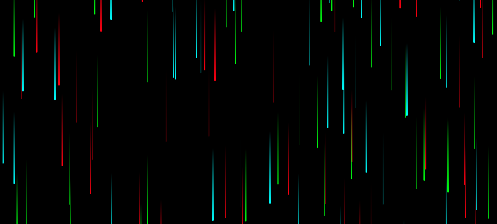

<h1 align="center"> Rain Mode </h1>

Efeito de uma chuva colorida criada através de js e css.

  <a href="#-tecnologias">Tecnologias</a>&nbsp;&nbsp;&nbsp;|&nbsp;&nbsp;&nbsp;
  <a href="#-projeto">Projeto</a>&nbsp;&nbsp;&nbsp;

 

  

## 🚀 Tecnologias

Esse projeto foi desenvolvido com:

- HTML e CSS
- JavaScript

## 💻 Projeto

Você pode visualizar o resultado clincando neste [LINK](https://kiqprado.github.io/Rain-Mode/).

---
 

  
  &nbsp;&nbsp;&nbsp;|&nbsp;&nbsp;&nbsp;
  
 

